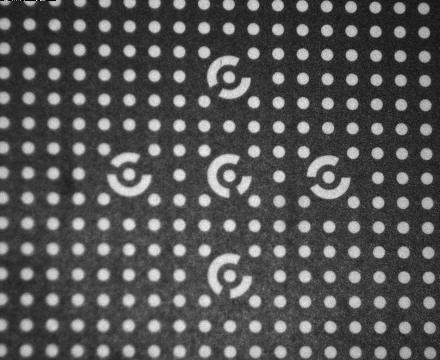

# 문제 1: 스테레오 카메라 캘리브레이션 시스템

첨부된 스테레오 이미지에서 원을 검출하고 카메라 캘리브레이션을 수행하는 프로그램을 구현합니다.

### 첨부 이미지
``` 
첨부이미지 imgs/1~5.bmp
``` 
<p align="left">
  
  
  
  
  
</p>

## 프로그램 요구사항

다음 조건을 만족하는 C++ 프로그램을 "stereo_calibration.cpp" 파일에 구현하세요:

1. **원 검출**: 첨부된 이미지에서 원의 중심을 검출합니다
2. **스테레오 캘리브레이션**: 검출된 원의 중심점 정보를 이용하여 스테레오 캘리브레이션을 진행합니다
3. **카메라 위치 계산**: 왼쪽 카메라를 원점(0,0,0)으로 기준했을 때 오른쪽 카메라의 위치를 계산합니다
4. **시스템 파라미터**: 스테레오 카메라 시스템의 베이스라인과 각도를 계산합니다

### 출력 예시

```
1. 원 검출 완료 시
   "검출된 원의 개수: N개"
   "원 중심 좌표: (x1, y1), (x2, y2), ..."

2. 캘리브레이션 완료 시
   "스테레오 캘리브레이션 RMS 에러: X.XXX"
   "오른쪽 카메라 위치: (X.XXX, Y.YYY, Z.ZZZ)"
   "베이스라인: X.XXX mm"
   "카메라 간 각도: X.XXX도"
```

## 구현 고려사항

1. **라이브러리**: C++와 OpenCV만 사용하여 구현합니다
2. **정확도**: 가능한 항목까지만 구현하되, 각 단계별 결과를 명확히 출력합니다
3. **에러 처리**: 원 검출 실패 시 적절한 에러 메시지를 출력합니다