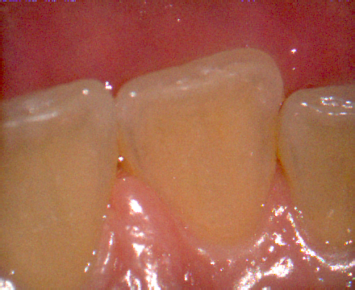
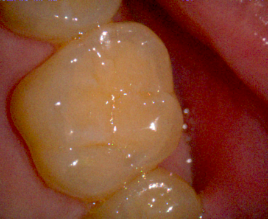
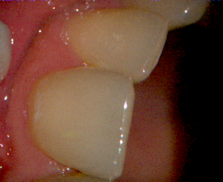
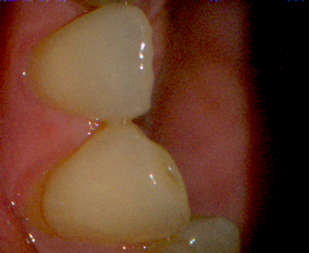
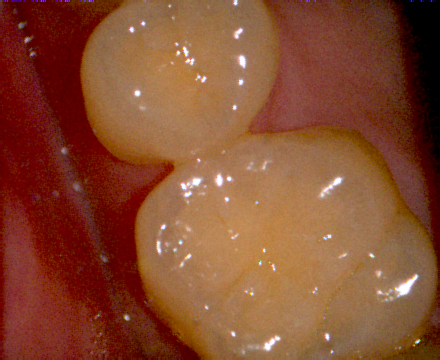

# 문제 : 치아 영역 자동 분할 시스템

첨부된 치아 이미지에서 색상 정보를 활용하여 치아 영역을 자동으로 분할하는 프로그램을 구현합니다.

### 첨부 이미지
``` 
첨부이미지 imgs/1~5.png
``` 
<p align="left">
  
  
  
  
  
</p>

## 프로그램 요구사항

다음 조건을 만족하는 C++ 프로그램을 "tooth_segmentation.cpp" 파일에 구현하세요:

1. **색상공간 변환**: 적절한 색상공간으로 변환하여 치아 영역을 효과적으로 분리합니다
2. **영역 분할**: 색상 정보를 기반으로 치아 영역을 배경에서 분리합니다
3. **결과 출력**: 원본 이미지와 분할된 치아 영역을 시각화하여 출력합니다

### 출력 예시

```
1. 프로그램 실행 시
   "이미지 로드 완료: image_name.jpg"
   "색상공간 변환: RGB → [선택한 색상공간]"
   
2. 분할 완료 시
   "치아 영역 분할 완료"
   "검출된 치아 영역 개수: N개"
   "전체 이미지 대비 치아 영역 비율: XX.X%"
```

## 구현 고려사항

1. **색상공간 선택**: HSV, LAB 등 치아 분할에 적합한 색상공간을 선택합니다
2. **노이즈 제거**: 형태학적 연산을 통해 노이즈를 제거합니다
3. **시각화**: 원본 이미지와 분할 결과를 함께 표시하여 비교가 가능하도록 합니다